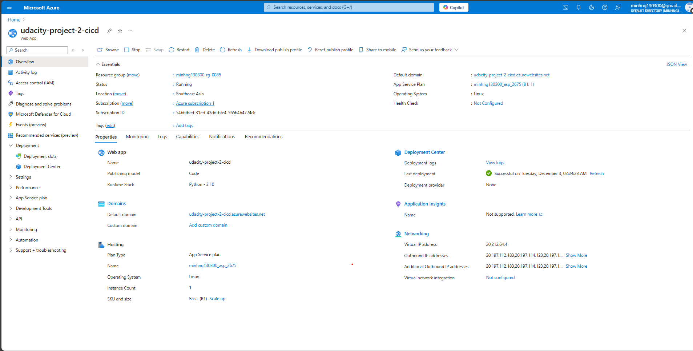
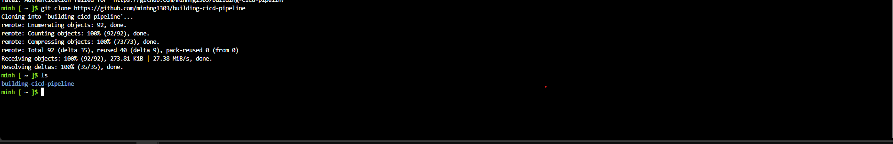
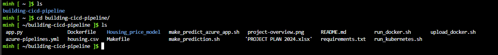
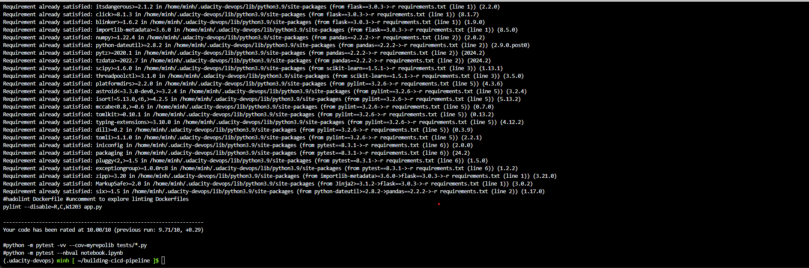
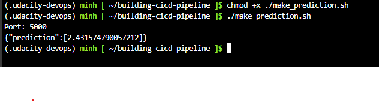
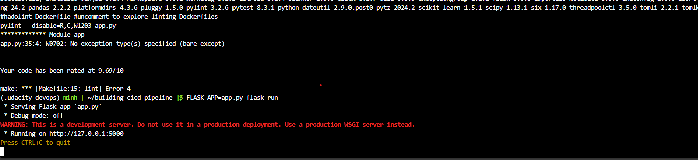

# Udacity Cloud DevOps using Microsoft Azure Nanodegree Program - Project: Building a CI/CD Pipeline

[](https://github.com/minhng1303/building-cicd-pipeline/blob/master/.github/workflows/pythonapp.yml)

## Project Overview
This project builds a continuous integration and continuous delivery pipeline for a machine learning application implemented with scikit-learn and Flask. The application provides Boston house price predictions.

Continuous integration is implemented using GitHub Actions along with a Makefile, requirements.txt, and application code to perform an initial lint, test, and install cycle. The project builds an integration with Azure Pipelines to enable Continuous Delivery to Azure App Service.

---

## Features
- Continuous Integration with GitHub Actions
- Continuous Delivery using Azure Pipelines
- Scikit-learn-based machine learning model for price prediction
- Deployment to Azure App Services

---

## Project Plan
- Spreadsheet with the estimated project plan: [Project Management Spreadsheet](https://github.com/minhng1303/building-cicd-pipeline/blob/master/PROJECT%20PLAN%202024.xlsx)
- Trello board for task tracking: [Azure CI/CD Pipeline Board](https://trello.com/b/Vt8CjsHG/cloud-devops-udacity-project2)

---

## Getting Started

### Prerequisites
To set up and run this project, you need the following:
- Python 3.x
- Azure Account
- GitHub Account

### Architecture


### Installation
1. Clone the repository:
   ```bash
   git clone https://github.com/minhng1303/building-cicd-pipeline
   ```
2. Navigate to the project directory:
   ```bash
   cd building-cicd-pipeline
   ```
3. Create a virtual Python environment and activate it:
   ```bash
   make setup
   source ~/.udacity-devops/bin/activate
   ```
4. Install dependencies:
   ```bash
   make install
   ```

### Running the Project
1. Run the application locally:
   ```bash
   FLASK_APP=app.py flask run
   ```
2. Open your browser and navigate to:
   ```
   http://localhost:5000
   ```
3. Test predictions:
   ```bash
   ./make_prediction.sh
   ```

---

## Deployment

### Deploy to Azure App Services
Run the following command to deploy the application to Azure App Services:
```bash
az webapp up \
    --resource-group minhng130300_rg_0085 \
    --name udacity-project-2-cicd \
    --sku F1 \
    --location southeastasia \
    --verbose
```
Visit the deployed application URL to verify deployment.

---

## CI/CD Pipeline

### GitHub Actions
GitHub Actions automates linting, testing, and building:
- Actions include:
  - `make install`
  - `make lint`
  - `make test`

### Azure Pipelines
Azure Pipelines deploy the application to Azure App Services. Follow these steps:
1. Create a project in [Azure DevOps](https://dev.azure.com/).
2. Set up a service connection for Azure Resource Manager.
3. Create a pipeline and connect it to the GitHub repository.
4. Deploy using variables for resource group and application name.

---

## Enhancements
Potential improvements:
- Use Git branches for staging environments
- Deploy infrastructure using Terraform
- Consolidate CI/CD workflows into a single tool

---

## Demo
View a video demonstration of the project: 

Part 1
[Project Demo](https://youtu.be/9-UoI0XNt_k)

Part 2
[Project Demo](https://youtu.be/hNu4Fo3t42s)

---

### Screenshots

Azure App Service used to deploy web app


Clone source code from github into Azure Cloud Shell



Running Make all


Make prediction test


Running app

